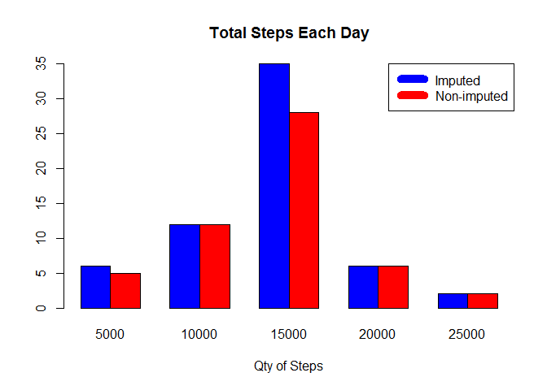

# Reproducible Research: Peer Assessment 1
## Data

The data for this assignment can be downloaded from the course web
site:

* Dataset: [Activity monitoring data](https://d396qusza40orc.cloudfront.net/repdata%2Fdata%2Factivity.zip) [52K]

The variables included in this dataset are:

- **steps**: Number of steps taking in a 5-minute interval (missing
    values are coded as `NA`)

- **date**: The date on which the measurement was taken in YYYY-MM-DD
    format

- **interval**: Identifier for the 5-minute interval in which
    measurement was taken


The dataset is stored in a comma-separated-value (CSV) file and there are a total of 17,568 observations and 3 variables.


## Loading and preprocessing the data

- Download data if they are absent from the working directory. - Unzip and read the csv data in a data table. ``data``


```r
if(!file.exists("activity.zip")) {
        temp <- tempfile()
        download.file("http://d396qusza40orc.cloudfront.net/repdata%2Fdata%2Factivity.zip",temp)
        unzip(temp)
        unlink(temp)
}
unzip("activity.zip")
data <- read.csv("activity.csv",header=TRUE)
```

## What is mean total number of steps taken per day?

- Total number of steps taken per day

```r
steps_by_day <- aggregate(steps ~ date, data, sum)
```

- Histogram frequency of quantity of steps taken each day

```r
hist(steps_by_day$steps, main = paste("Total Steps per Day"),col="green", xlab="Qty of Steps")
```

 

```r
Stepmean <-round(mean(steps_by_day$steps),2)
Stepmedian <- median(steps_by_day$steps)
```

>Mean of the total steps taken per day is **1.076619\times 10^{4}**

>Median of the total steps taken per day is **10765**


## What is the average daily activity pattern?
- average of steps by interval dayly    
    Plot ;   
- 5-minute interval for each day (x-axis),  
- averaged number of steps across all interval per days (y-axis)


```r
steps_by_interval <- aggregate(steps ~ interval, data, mean)

plot(steps_by_interval$interval,steps_by_interval$steps, col="red",lwd=3, type="l", xlab="Interval", ylab="Number of Steps",main="Average Number of Steps per Day by Interval")
```

 

- define interval, with maximum average's step   

```r
max_interval <- steps_by_interval[which.max(steps_by_interval$steps),1]
```

>The interval, on average across all the days in data set, containing the maximum number of steps is INTERVAL **835**

## Imputing missing values

A simple imputation. Missing values were imputed by inserting the average for each interval. Thus, if interval 10 was missing on 10-02-2012, the average for that interval for all days (0.1320755), replaced the NA.


```r
dataNA <- sum(!complete.cases(data))
imputed_data <- transform(data, steps = ifelse(is.na(data$steps), steps_by_interval$steps[match(data$interval, steps_by_interval$interval)], data$steps))
```
Zeroes for 10-01-2012 because it was, which had all 288 steps equal NA . We're assumed to be zeros to fit the trend of the data. 

```r
imputed_data[as.character(imputed_data$date) == "2012-10-01", 1] <- 0
```
Recount total steps by day and create Histogram to show difference with step by day without imputed data.

```r
steps_by_day_i <- aggregate(steps ~ date, imputed_data, sum)
```

```r
his1 <- hist(steps_by_day_i$steps,plot=FALSE)
his2 <- hist(steps_by_day$steps,plot=FALSE)
mat <- rbind(his1$counts, his2$counts)
colnames(mat)<-c("5000","10000","15000","20000","25000")
barplot(mat, beside = TRUE,main = paste("Total Steps Each Day"),xlab="Qty of Steps", col = c("blue", "red"))
legend("topright", c("Imputed", "Non-imputed"), col=c("blue", "red"), lwd=10)
```

 
Calculate new mean and median for imputed data, and difference between imputed (rmean.i , rmedian.i)and non-imputed data (Stepmean , Stepmedian).

```r
rmean.i <- mean(steps_by_day_i$steps)
rmedian.i <- median(steps_by_day_i$steps)
mean_diff <- rmean.i - Stepmean
med_diff <- rmedian.i - Stepmedian
```
Calculate total difference.

```r
total_diff <- sum(steps_by_day_i$steps) - sum(steps_by_day$steps)
```
- The imputed data mean is **1.0589694\times 10^{4}**
- The imputed data median is **1.0766189\times 10^{4}**
- The difference between the non-imputed mean and imputed mean is **-176.4962171**
- The difference between the non-imputed mean and imputed mean is **1.1886792**
- The difference between total number of steps between imputed and non-imputed data is **7.5363321\times 10^{4}**.
- Thus, there were **7.5363321\times 10^{4}** more steps in the imputed data.


## Are there differences in activity patterns between weekdays and weekends?

Created a plot to compare and contrast number of steps between the week and weekend.    
my computer speake french sorry :)   


```r
daysnames <- c("lundi","mardi","mercredi","jeudi","vendredi")
imputed_data$day = as.factor(ifelse(is.element(weekdays(as.Date(imputed_data$date)),daysnames), "Weekday", "Weekend"))

steps_by_interval_i <- aggregate(steps ~ interval + day, imputed_data, mean)

library(lattice)

xyplot(steps_by_interval_i$steps ~ steps_by_interval_i$interval|steps_by_interval_i$day, main="Average Steps per Day by Interval",xlab="Interval", ylab="Steps",layout=c(1,2), type="l")
```

 


- There is a higher peak earlier on weekdays, and a more regular activity weekend.
 

```r
daysnames <- c("Monday","Tuesday","Wednesday","Thursday","Friday")
imputed_data$day = as.factor(ifelse(is.element(weekdays(as.Date(imputed_data$date)),daysnames), "Weekday", "Weekend"))

steps_by_interval_i <- aggregate(steps ~ interval + day, imputed_data, mean)

library(lattice)

xyplot(steps_by_interval_i$steps ~ steps_by_interval_i$interval|steps_by_interval_i$day, main="Average Steps per Day by Interval",xlab="Interval", ylab="Steps",layout=c(1,2), type="l")
```

 


- There is a higher peak earlier on weekdays, and a more regular activity weekend.
